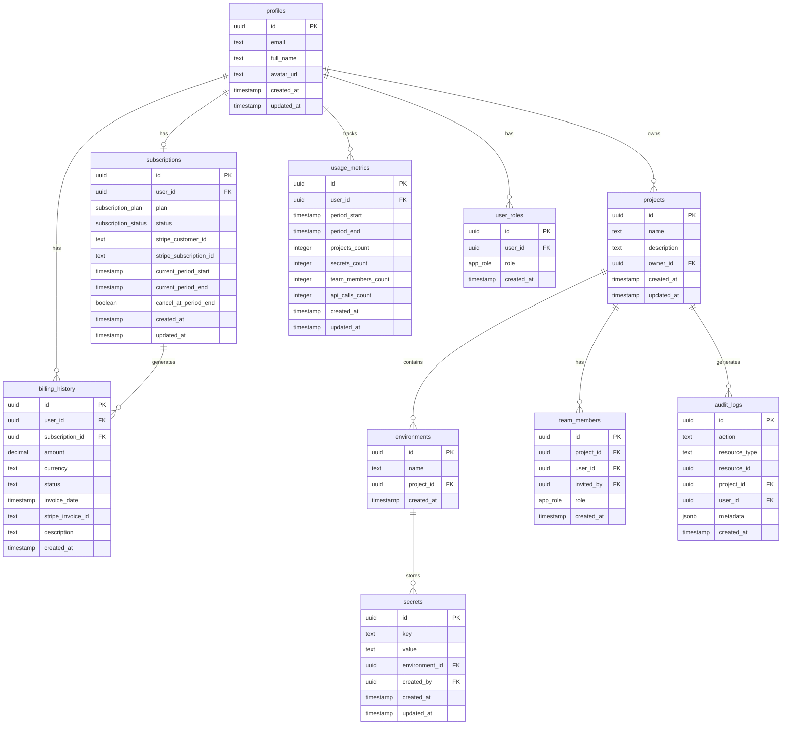

# EnvVault Database Schema Documentation

**Last Updated:** 2025-11-16

## Overview

This document provides a comprehensive overview of the EnvVault database schema, including all tables, columns, relationships, Row Level Security (RLS) policies, and database functions.

---

## Entity Relationship Diagram



---

## Tables

### 1. profiles
**Purpose:** Stores user profile information

| Column | Type | Nullable | Default | Description |
|--------|------|----------|---------|-------------|
| id | uuid | No | - | Primary key, references auth.users |
| email | text | No | - | User's email address |
| full_name | text | Yes | null | User's full name |
| avatar_url | text | Yes | null | URL to user's avatar |
| created_at | timestamp with time zone | No | now() | Profile creation timestamp |
| updated_at | timestamp with time zone | No | now() | Last update timestamp |

**RLS Policies:**
- ✅ Users can view their own profile (SELECT)
- ✅ Users can insert their own profile (INSERT)
- ✅ Users can update their own profile (UPDATE)

**Triggers:**
- `on_profile_created` - Creates default subscription after profile insert

---

### 2. projects
**Purpose:** Main projects that contain environments and secrets

| Column | Type | Nullable | Default | Description |
|--------|------|----------|---------|-------------|
| id | uuid | No | gen_random_uuid() | Primary key |
| name | text | No | - | Project name |
| description | text | Yes | null | Project description |
| owner_id | uuid | No | - | Project owner's user ID |
| created_at | timestamp with time zone | No | now() | Creation timestamp |
| updated_at | timestamp with time zone | No | now() | Last update timestamp |

**RLS Policies:**
- ✅ Users can view projects they own or are members of (SELECT)
- ✅ Users can create projects (INSERT)
- ✅ Project owners can update their projects (UPDATE)
- ✅ Project owners can delete their projects (DELETE)

**Triggers:**
- `create_default_environments` - Creates dev/staging/prod environments after project insert
- `track_project_usage` - Updates usage metrics when projects are added/deleted
- `update_projects_updated_at` - Updates updated_at timestamp

---

### 3. environments
**Purpose:** Environment configurations (development, staging, production)

| Column | Type | Nullable | Default | Description |
|--------|------|----------|---------|-------------|
| id | uuid | No | gen_random_uuid() | Primary key |
| name | text | No | - | Environment name (dev/staging/prod) |
| project_id | uuid | No | - | Parent project ID |
| created_at | timestamp with time zone | No | now() | Creation timestamp |

**Foreign Keys:**
- project_id → projects.id

**RLS Policies:**
- ✅ Users can view environments for accessible projects (SELECT)
- ✅ Project owners can manage environments (ALL)

---

### 4. secrets
**Purpose:** Stores encrypted environment variables and secrets

| Column | Type | Nullable | Default | Description |
|--------|------|----------|---------|-------------|
| id | uuid | No | gen_random_uuid() | Primary key |
| key | text | No | - | Secret key name |
| value | text | No | - | Secret value (encrypted) |
| environment_id | uuid | No | - | Parent environment ID |
| created_by | uuid | No | - | User who created the secret |
| created_at | timestamp with time zone | No | now() | Creation timestamp |
| updated_at | timestamp with time zone | No | now() | Last update timestamp |

**Foreign Keys:**
- environment_id → environments.id

**RLS Policies:**
- ✅ Users can view secrets for accessible projects (SELECT)
- ✅ Project owners and members can create secrets (INSERT)
- ✅ Project owners and members can update secrets (UPDATE)
- ✅ Project owners and members can delete secrets (DELETE)

**Triggers:**
- `track_secret_usage` - Updates usage metrics when secrets are added/deleted
- `update_secrets_updated_at` - Updates updated_at timestamp

---

### 5. team_members
**Purpose:** Manages team access to projects

| Column | Type | Nullable | Default | Description |
|--------|------|----------|---------|-------------|
| id | uuid | No | gen_random_uuid() | Primary key |
| project_id | uuid | No | - | Project ID |
| user_id | uuid | No | - | Team member's user ID |
| invited_by | uuid | No | - | User who sent the invitation |
| role | app_role | No | 'viewer' | Team member's role |
| created_at | timestamp with time zone | No | now() | Invitation timestamp |

**Foreign Keys:**
- project_id → projects.id

**RLS Policies:**
- ✅ Users can view team members for accessible projects (SELECT)
- ✅ Project owners can manage team members (ALL)

**Triggers:**
- `track_team_member_usage` - Updates usage metrics when team members are added/deleted

---

### 6. user_roles
**Purpose:** Global user roles (admin, member, viewer)

| Column | Type | Nullable | Default | Description |
|--------|------|----------|---------|-------------|
| id | uuid | No | gen_random_uuid() | Primary key |
| user_id | uuid | No | - | User ID |
| role | app_role | No | 'member' | User's global role |
| created_at | timestamp with time zone | No | now() | Role assignment timestamp |

**RLS Policies:**
- ✅ Users can view their own roles (SELECT)
- ✅ Admins can manage all roles (ALL)

---

### 7. subscriptions
**Purpose:** Manages user subscription plans and billing

| Column | Type | Nullable | Default | Description |
|--------|------|----------|---------|-------------|
| id | uuid | No | gen_random_uuid() | Primary key |
| user_id | uuid | No | - | User ID (unique) |
| plan | subscription_plan | No | 'free' | Current plan (free/team/enterprise) |
| status | subscription_status | No | 'active' | Subscription status |
| stripe_customer_id | text | Yes | null | Stripe customer ID |
| stripe_subscription_id | text | Yes | null | Stripe subscription ID |
| current_period_start | timestamp with time zone | Yes | null | Billing period start |
| current_period_end | timestamp with time zone | Yes | null | Billing period end |
| cancel_at_period_end | boolean | No | false | Cancel at period end flag |
| created_at | timestamp with time zone | No | now() | Creation timestamp |
| updated_at | timestamp with time zone | No | now() | Last update timestamp |

**Unique Constraints:**
- user_id (one subscription per user)

**RLS Policies:**
- ✅ Users can view their own subscription (SELECT)
- ✅ Users can insert their own subscription (INSERT)
- ✅ Users can update their own subscription (UPDATE)

**Triggers:**
- `update_subscriptions_updated_at` - Updates updated_at timestamp

---

### 8. usage_metrics
**Purpose:** Tracks resource usage per billing period

| Column | Type | Nullable | Default | Description |
|--------|------|----------|---------|-------------|
| id | uuid | No | gen_random_uuid() | Primary key |
| user_id | uuid | No | - | User ID |
| period_start | timestamp with time zone | No | - | Billing period start |
| period_end | timestamp with time zone | No | - | Billing period end |
| projects_count | integer | No | 0 | Number of projects |
| secrets_count | integer | No | 0 | Number of secrets |
| team_members_count | integer | No | 0 | Number of team members |
| api_calls_count | integer | No | 0 | Number of API calls |
| created_at | timestamp with time zone | No | now() | Creation timestamp |
| updated_at | timestamp with time zone | No | now() | Last update timestamp |

**Unique Constraints:**
- (user_id, period_start) - One metric record per user per period

**RLS Policies:**
- ✅ Users can view their own usage metrics (SELECT)
- ✅ System can insert usage metrics (INSERT)

**Triggers:**
- `update_usage_metrics_updated_at` - Updates updated_at timestamp

---

### 9. billing_history
**Purpose:** Stores billing and invoice records

| Column | Type | Nullable | Default | Description |
|--------|------|----------|---------|-------------|
| id | uuid | No | gen_random_uuid() | Primary key |
| user_id | uuid | No | - | User ID |
| subscription_id | uuid | Yes | null | Related subscription ID |
| amount | decimal(10,2) | No | - | Invoice amount |
| currency | text | No | 'usd' | Currency code |
| status | text | No | - | Payment status |
| invoice_date | timestamp with time zone | No | now() | Invoice date |
| stripe_invoice_id | text | Yes | null | Stripe invoice ID |
| description | text | Yes | null | Invoice description |
| created_at | timestamp with time zone | No | now() | Creation timestamp |

**Foreign Keys:**
- subscription_id → subscriptions.id (ON DELETE SET NULL)

**RLS Policies:**
- ✅ Users can view their own billing history (SELECT)

---

### 10. audit_logs
**Purpose:** Tracks all system actions for security and compliance

| Column | Type | Nullable | Default | Description |
|--------|------|----------|---------|-------------|
| id | uuid | No | gen_random_uuid() | Primary key |
| action | text | No | - | Action performed |
| resource_type | text | No | - | Type of resource affected |
| resource_id | uuid | Yes | null | ID of resource affected |
| project_id | uuid | No | - | Related project ID |
| user_id | uuid | Yes | null | User who performed action |
| metadata | jsonb | Yes | null | Additional action metadata |
| created_at | timestamp with time zone | No | now() | Action timestamp |

**Foreign Keys:**
- project_id → projects.id

**RLS Policies:**
- ✅ Users can view audit logs for accessible projects (SELECT)
- ✅ System can insert audit logs (INSERT)

---

## Custom Types (Enums)

### app_role
User role types for access control
- `admin` - Full system access
- `member` - Standard user access
- `viewer` - Read-only access

### subscription_plan
Available subscription tiers
- `free` - Free tier (3 projects, 10 secrets/project, 1 team member)
- `team` - Team tier (10 projects, 100 secrets/project, 10 team members)
- `enterprise` - Enterprise tier (unlimited resources)

### subscription_status
Subscription state
- `active` - Active subscription
- `canceled` - Canceled subscription
- `past_due` - Payment past due
- `trialing` - Trial period

---

## Database Functions

### 1. get_plan_limits(plan_type)
**Purpose:** Returns resource limits for a given subscription plan

**Parameters:**
- `plan_type: subscription_plan` - The plan to get limits for

**Returns:** JSON object with limits
```json
{
  "projects": 3,
  "secrets_per_project": 10,
  "team_members": 1,
  "environments": 3
}
```

---

### 2. check_plan_limits(user_uuid)
**Purpose:** Checks if user has exceeded their plan limits

**Parameters:**
- `user_uuid: uuid` - User ID to check

**Returns:** JSON object with plan, limits, and current usage
```json
{
  "plan": "free",
  "limits": {...},
  "usage": {
    "projects": 2,
    "team_members": 0,
    "exceeds_limits": false
  }
}
```

**Security:** SECURITY DEFINER, search_path = public

---

### 3. has_role(user_id, role)
**Purpose:** Checks if a user has a specific global role

**Parameters:**
- `_user_id: uuid` - User ID to check
- `_role: app_role` - Role to verify

**Returns:** boolean

**Security:** SECURITY DEFINER, search_path = public

---

### 4. has_project_access(user_id, project_id)
**Purpose:** Checks if a user has access to a project (as owner or team member)

**Parameters:**
- `_user_id: uuid` - User ID to check
- `_project_id: uuid` - Project ID to verify

**Returns:** boolean

**Security:** SECURITY DEFINER, search_path = public

---

### 5. handle_new_user()
**Purpose:** Trigger function to create profile and assign default role on user signup

**Returns:** trigger

**Security:** SECURITY DEFINER, search_path = public

---

### 6. handle_updated_at()
**Purpose:** Trigger function to automatically update updated_at timestamps

**Returns:** trigger

**Security:** search_path = public

---

### 7. create_default_environments()
**Purpose:** Trigger function to create dev/staging/prod environments for new projects

**Returns:** trigger

**Security:** SECURITY DEFINER, search_path = public

---

### 8. create_default_subscription()
**Purpose:** Trigger function to create free subscription for new users

**Returns:** trigger

**Security:** SECURITY DEFINER, search_path = public

---

### 9. update_usage_metrics()
**Purpose:** Trigger function to track resource usage across projects, secrets, and team members

**Returns:** trigger

**Security:** SECURITY DEFINER, search_path = public

---

## Triggers

| Trigger Name | Table | Event | Function | Description |
|-------------|-------|-------|----------|-------------|
| on_auth_user_created | auth.users | AFTER INSERT | handle_new_user() | Create profile and role on signup |
| on_profile_created | profiles | AFTER INSERT | create_default_subscription() | Create subscription on profile creation |
| create_default_environments | projects | AFTER INSERT | create_default_environments() | Create 3 environments for new projects |
| track_project_usage | projects | AFTER INSERT/DELETE | update_usage_metrics() | Track project count |
| track_secret_usage | secrets | AFTER INSERT/DELETE | update_usage_metrics() | Track secret count |
| track_team_member_usage | team_members | AFTER INSERT/DELETE | update_usage_metrics() | Track team member count |
| update_projects_updated_at | projects | BEFORE UPDATE | handle_updated_at() | Update timestamp |
| update_secrets_updated_at | secrets | BEFORE UPDATE | handle_updated_at() | Update timestamp |
| update_subscriptions_updated_at | subscriptions | BEFORE UPDATE | handle_updated_at() | Update timestamp |
| update_usage_metrics_updated_at | usage_metrics | BEFORE UPDATE | handle_updated_at() | Update timestamp |

---

## Plan Limits Reference

| Feature | Free | Team | Enterprise |
|---------|------|------|------------|
| Projects | 3 | 10 | Unlimited |
| Secrets per Project | 10 | 100 | Unlimited |
| Team Members | 1 | 10 | Unlimited |
| Environments | 3 | 3 | Unlimited |

---

## Security Notes

1. **Row Level Security (RLS):** All tables have RLS enabled
2. **SECURITY DEFINER Functions:** Functions that bypass RLS have explicit search_path set
3. **Foreign Key Cascades:** Proper cascading deletes configured for data integrity
4. **Authentication Required:** Most operations require authenticated users (auth.uid())
5. **Role-Based Access:** Granular permissions through app_role enum

---

## Migration History

| Date | Description |
|------|-------------|
| 2025-11-16 | Initial schema with projects, environments, secrets |
| 2025-11-16 | Added team_members and audit_logs |
| 2025-11-16 | Added subscription system (subscriptions, usage_metrics, billing_history) |
| 2025-11-16 | Fixed function search paths for security |

---

**Note:** This document should be updated whenever schema changes are made to the database.
